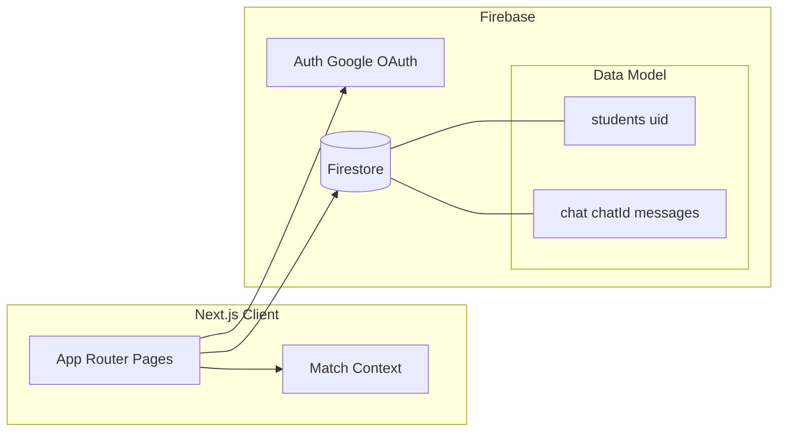

# Study Group Matcher

[](https://nextjs.org/)
[](https://react.dev/)
[](https://www.typescriptlang.org/)
[](https://firebase.google.com/)

> End-to-end web platform that pairs students for study groups using **structured profile data**, **real-time synchronization**, and a **deterministic matching engine** backed by **Firebase**. Architected for clear separation of domain types, streaming reads, and OAuth-gated persistence—designed so retrieval and ranking can evolve toward **embedding-based** and **LLM-assisted** workflows without rewriting the product surface.

Replace the badge links above with your repo: `https://github.com/<your-org>/<your-repo>`.

---

## Short Technical Overview

Study Group Matcher is a **full-stack style** Next.js application (App Router) that uses **Firebase Authentication (Google OAuth)** and **Cloud Firestore** as the system of record. Users submit courses, availability windows, and study preferences; the app **normalizes** those fields and runs a **multi-constraint matcher** (shared courses **and** overlapping time slots). **Realtime listeners** keep rosters and chat threads fresh. The stack targets **low-latency collaboration UX** and a **straightforward path to scale-out** (indexed queries, background workers, semantic retrieval) as the user base grows.

---

## Key Features

- **Identity & onboarding** — Google sign-in via Firebase Auth; lazy creation of a `students/{uid}` document on first login with profile fields and provider metadata.
- **Profile persistence** — Upsert of student documents keyed by Firebase UID; hydration of match state on session restore.
- **Constrained matching** — Deterministic candidate generation: lexical normalization (trim, lowercase), set intersection over course tokens and availability tokens, self-match exclusion.
- **Realtime directory** — `onSnapshot` subscription over the `students` collection for a live roster view (operational visibility / debugging / future admin tooling).
- **Peer messaging** — Deterministic **conversation IDs** from sorted participant UIDs; subcollection `chat/{chatId}/messages` with `serverTimestamp()` ordering and streaming message history.
- **Cross-route state** — React context for match results so dashboard, profile, and dedicated match views stay consistent without prop drilling.

---

## System Architecture



| Layer | Responsibility |
|--------|----------------|
| **Presentation** | Next.js 15 App Router, React 19, Tailwind CSS 4, Radix-based UI primitives |
| **Application logic** | Client-side orchestration: auth state, form submit → Firestore write → matcher invocation |
| **Matching** | Pure function over in-memory cohort (full collection read today); output typed `Match[]` |
| **Data** | Firestore document store; nested messages under per-chat paths |
| **Realtime** | Firestore snapshot listeners for students and per-chat message queries |

**Note:** Business logic currently runs in the browser via the Firebase Web SDK. A **production-hardening** step is to move matching and sensitive writes behind **Firebase Cloud Functions** or a **Next.js Route Handler / Edge** layer with admin credentials, rate limits, and validation—see *Future Improvements*.

---

## AI / ML Components (Current & Evolution Path)

**Shipped today (rules-based “retrieval”):**  
The matcher behaves like a **boolean-constrained retriever**: candidates must satisfy **hard filters** on course overlap and time overlap. This is **not** embedding-based; it is fast to reason about, auditable, and deterministic—useful baselines in production recommender systems.

**Natural extensions for Applied AI / ML Engineering interviews:**

| Capability | Role in a modern stack |
|------------|-------------------------|
| **Dense embeddings** of courses + study-style text | Semantic similarity beyond exact string match (e.g. “Linear Algebra” ↔ “MATH 221”) |
| **Vector database** (Pinecone, pgvector, Firestore vector extensions, Vertex AI Matching Engine) | Sub-linear approximate nearest neighbor search at scale |
| **Hybrid retrieval** | Lexical filters (time, campus) + semantic top-*k* rerank |
| **LLM orchestration** | Structured extraction of availability from free text; explanation of “why we matched you” |
| **Evaluation** | Offline labeled pairs, precision@k, diversity metrics, latency SLOs |

Positioning this project honestly while showing **systems thinking**: *rules engine now, clear seam for embedding/RAG later*.

---

## Tech Stack

| Area | Choices |
|------|---------|
| **Framework** | Next.js **15.3** (App Router), **Turbopack** dev server |
| **UI** | React **19**, Tailwind CSS **4**, Radix UI, Lucide icons |
| **Language** | TypeScript (app) with Firebase bootstrap in JS (`src/lib/firebase.js`) |
| **Auth** | Firebase Auth, `GoogleAuthProvider`, popup flow |
| **Database** | Cloud Firestore (documents + subcollections) |
| **Tooling** | ESLint (Next config), `next lint` |

---

## Backend Infrastructure

- **Authentication:** OAuth 2.0–backed Google sign-in; Firebase session propagation via `onAuthStateChanged`.
- **Database:** Firestore **collections**:
  - `students` — one document per user (`docId === uid`), fields include `courses`, `availability`, `studyStyle`, `university`, denormalized `image`/`email` where used.
  - `chat/{sortedUidPair}/messages` — message docs with `senderId`, `receiverId`, `text`, `timestamp` (`serverTimestamp()`).
- **Realtime:** `onSnapshot` for roster and ordered message queries (`orderBy('timestamp', 'asc')`).
- **Consistency:** Chat room IDs are **commutative** (`sort` UIDs then join) so both participants resolve the same path—avoids duplicate thread documents.
- **Security:** *Recommended* — Firestore Security Rules locking writes to `request.auth.uid`, validating field shapes, and scoping chat writes to participants (not fully reflected in this repo’s docs—treat as a deployment requirement).

---

## Deployment Details

- **Target platform:** [Vercel](https://vercel.com/) (native Next.js integration) or any Node host running `next build` / `next start`.
- **Configuration:** Firebase project with Firestore and Google provider enabled; web app config supplied via **`NEXT_PUBLIC_*`** environment variables (see Installation).
- **CI/CD (recommended):** GitHub Actions running `npm ci`, `npm run lint`, `npm run build`; preview deployments per PR.
- **Secrets:** Never commit `.env.local`; use Vercel/host env UI for public Firebase keys (Firebase web keys are public by design—**rules + App Check** still matter).

---

## Challenges & Engineering Decisions

1. **Client-side vs server-side matching** — Chosen for iteration speed and zero cold-start on a small cohort. **Trade-off:** `getDocs` on the full `students` collection is **O(n)** per match; acceptable for demos and early usage, not for large corpora without pagination or server-side indexing.
2. **String-encoded multi-value fields** — Courses and availability are comma-separated strings, split at match time. **Trade-off:** simple authoring UX; **future:** arrays, canonical course IDs, timezone-aware slots.
3. **Deterministic chat IDs** — Avoids a separate “conversations” lookup table and merge conflicts; **trade-off:** must keep ID scheme stable if group chats are added later.
4. **Global context for matches** — Centralizes match state across routes; **trade-off:** consider URL/session persistence or SWR/React Query if the app grows.
5. **Type safety boundary** — Firebase init in JS while app code is TS; **future:** unify module to `.ts` and strict env typing.

---

## Performance & Scalability Improvements

**Already aligned with production-minded patterns**

- Streaming reads instead of polling for chat and roster.
- Server-authoritative timestamps for message ordering.
- Normalized matching inputs to reduce false negatives from casing/spacing.

**Next steps for measurable scale**

| Improvement | Expected impact |
|-------------|------------------|
| Firestore **composite indexes** + **query-filtered** candidate sets (e.g. by `university`) | Cuts documents read per match from *all users* to *relevant subset* |
| **Pagination** / cursor-based reads for admin views | Bounded memory and transfer |
| **Cloud Functions** trigger on `students` write → recompute matches asynchronously | Decouples UX from batch cost; enables notifications |
| **Caching** (Redis / Cloud Memorystore) for hot cohort slices | Lower repeat read cost for busy campuses |
| **Embedding index** + hybrid retrieval | Better relevance + sub-linear search as *n* grows |

---

## Future Improvements

- **Security rules + Firebase App Check**; optional **Custom Claims** for moderators.
- **Server-side API** (Route Handlers or Cloud Functions) for matching, validation, and abuse protection.
- **Semantic matching** pipeline: embedding model, batch or on-write vector upsert, ANN search, reranker.
- **Observability:** structured logging, Firestore usage metrics, client RUM (e.g. Vercel Analytics).
- **Testing:** unit tests for matcher; emulator-based integration tests for Auth/Firestore.
- **Accessibility & i18n** polish on forms and chat.

---

## Screenshots / Demo

Add 3–5 images under `docs/screenshots/` (or your preferred path) and link them here.

| Area | Suggested capture |
|------|-------------------|
| Sign-in | Google OAuth entry |
| Match form | Course + availability submission |
| Match results | Overlapping courses/times |
| Chat | Realtime thread |
| Dashboard | Aggregated stats / profile |

**Optional:** Deploy a public demo on Vercel and link **Live Demo** at the top of this README.

---

## Installation Instructions

### Prerequisites

- Node.js **20+** (LTS recommended)
- npm (or pnpm/yarn/bun per your policy)
- A **Firebase** project with **Authentication (Google)** and **Firestore** enabled

### Setup

```bash
git clone https://github.com/<your-org>/<your-repo>.git
cd my-study-matcher
npm install
```

Create `.env.local` in the project root:

```bash
NEXT_PUBLIC_FIREBASE_API_KEY=
NEXT_PUBLIC_FIREBASE_AUTH_DOMAIN=
NEXT_PUBLIC_FIREBASE_PROJECT_ID=
NEXT_PUBLIC_FIREBASE_STORAGE_BUCKET=
NEXT_PUBLIC_FIREBASE_MESSAGING_SENDER_ID=
NEXT_PUBLIC_FIREBASE_APP_ID=
NEXT_PUBLIC_FIREBASE_MEASUREMENT_ID=   # optional
```

```bash
npm run dev
# http://localhost:3000
```

Other scripts: `npm run build`, `npm start`, `npm run lint`.

---

## API & System Flow Overview

There is **no custom REST API** in-repo; the app talks **directly** to Firebase. High-level flows:

### Authentication & provisioning

1. User clicks **Sign in with Google** → `signInWithPopup`.
2. If `students/{uid}` missing → `setDoc` with defaults and provider profile fields.
3. Matcher runs on the resulting `Student` shape; results stored in client context.

### Profile update & match

1. Authenticated user submits profile form on `/match`.
2. `setDoc` merges into `students/{uid}`.
3. `matchStudents` loads cohort (`getDocs(students)`), normalizes fields, emits `Match[]`.
4. Context updates; UI surfaces matches and enables chat.

### Realtime chat

1. Compose `chatId = sort(uidA, uidB).join('_')`.
2. Subscribe to `chat/{chatId}/messages` ordered by `timestamp`.
3. `addDoc` on send with `serverTimestamp()`.

```text
[Browser] --OAuth--> [Firebase Auth]
[Browser] --read/write--> [Firestore: students, chat/.../messages]
[Browser] --snapshot streams--> [UI: roster, messages, matches]
```

---

## Resume-Style Impact Summary

- Architected and shipped a **Next.js 15 / React 19** experience with **Firebase Auth + Firestore**, including **OAuth onboarding** and **UID-keyed document modeling**.
- Implemented a **multi-constraint matching engine** with **normalized lexical matching**, **self-match exclusion**, and **typed domain models** bridging Firestore documents to application structs.
- Delivered **real-time collaboration** via Firestore **snapshot listeners** for directory and **ordered chat histories** with **server timestamps** and **deterministic conversation routing**.
- Established a **scalability roadmap**: query-scoped reads, asynchronous recomputation, **caching**, and **embedding-based retrieval**—articulating trade-offs between client-side iteration speed and production-grade backend isolation.

---

## Suggested README / Repo Additions (Optional)

Sections you may add over time:

- **Threat model & Security Rules** (snippet or link)
- **Architecture Decision Records** (`docs/adr/`)
- **Runbook** (Firebase indexes required, quota alerts)
- **Contributing** / **Code of Conduct**

Badge ideas (after CI exists):

```markdown

```

---

## Repository Organization (Recommendations)

| Change | Why |
|--------|-----|
| `src/lib/firebase.js` → `firebase.ts` + typed env | Single language boundary, stricter config |
| `app/api/*` or Cloud Functions for match + chat writes | Enforce authz, rate limits, and hide implementation details |
| `packages/matcher` or `src/lib/matcher.ts` | Pure logic isolated from UI; unit-testable |
| `docs/` for ERD, sequence diagrams, demo GIFs | Recruiter-friendly depth |
| `.github/workflows/ci.yml` | Signals engineering maturity |
| `firestore.rules` + `firestore.indexes.json` in repo | IaC for backend; reviewable in PRs |

---

## Stronger Signal for AI / New-Grad Recruiting

1. **Add a small semantic layer** — Even a **single embedding model** (e.g. sentence-transformers or hosted API) with **kNN in memory** on a labeled subset demonstrates end-to-end ML integration.
2. **Publish evaluation** — Table: baseline rules vs embedding reranker on a toy labeled set (precision@k, latency).
3. **Inference boundaries** — Batch vs on-demand embedding; document cold-start handling.
4. **Cost/latency estimate** — Back-of-envelope reads/writes per user session; shows product thinking.
5. **1-page architecture PDF** in `docs/` — Often easier for recruiters than scrolling code.

---

*README aligned with the current codebase: Next.js App Router, Firebase Auth/Firestore, rules-based matching, realtime chat. Update the “AI / ML” and scalability bullets as you ship server-side or embedding features.*
